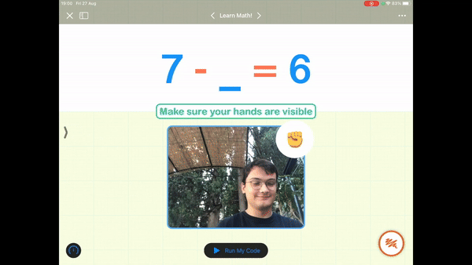
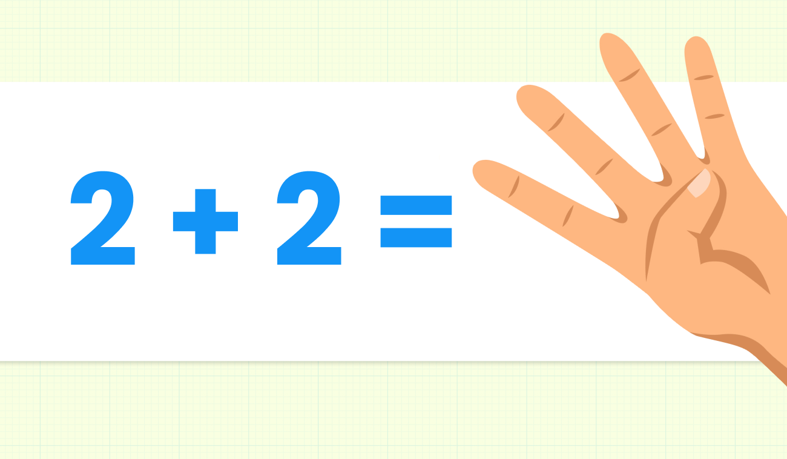

# 2 plus 2: Learn math with AI

2 plus 2 is an interactive iOS playground book that helps children learn math using handwriting recognition, gesture detection, and augmented reality.

* Written in Swift
* Powered by ComputerVision, ARKit, UIKit and SwiftUI
* Auto Layout was written entirely with code

## Technical Details
I designed and built the first page in SwiftUI to welcome users to the playground book. It’s important for me to create a great user experience where kids feel welcomed and are introduced to the experience. As you open the first page, you’ll hear an upbeat melody that invites you to start the playground experience. The second page displays some math questions that users can answer by drawing a number on the keypad or by showing their hands to the camera. Finally, the third page introduces a twist with Apple’s augmented reality framework ARKit: users are invited to answer math questions in the real world for an immersive experience. I love adding a personal touch to my projects, such as mimicking the texture of the paper to invite the kids to write on the screen and by reproducing self-recorded sound effects to congratulate the user on getting the answer right. What’s more, if the kid seems to struggle with a certain question, the playground book will skip it to ensure a frustration-free experience. 

While this is designed to be an effortless experience, there’s a lot of technology at work behind these features: handwriting recognition and hand gestures recognition are powered by Apple’s Vision framework. The most challenging part of creating this playground experience was creating and implementing the Machine Learning models that recognize the kids’ handwriting and gestures. These models have been designed to be accurate enough to work well with several scenarios and skin colors, and light enough to conform to the 25 MB submission requirements. I built the handwritten digit classifier with Python on the MNIST public dataset, boosting over 60,000 images of handwritten digits between 0 and 9. The second model that recognizes the gestures was incredibly challenging to build: I fed it with about 350 photos of my hand for every number gesture. Finally, I wrote code that uses CoreML and the Vision frameworks to have the playground book use these custom models.

## Motivation
As a kid with dyslexia, I have struggled to learn Math and decided to build a playground book to support children with their learning in these challenging times. This playground book uses advanced features such as handwriting recognition and Machine Learning to create an interactive experience for kids to learn Math. In other words, this playground book is what I wish I had when I was back in elementary school. 

